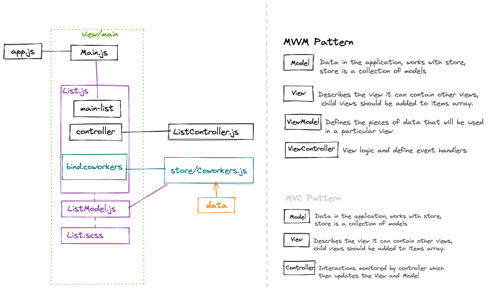

# Workspace and app set up

### In your workspace you can have multiple framework versions and multiple applications

- cd .\ext-7.6.0 (cd into the source folder)

- sencha generate workspace ../ext-workspace (folder name you choose [ext-workspace])

- cd into ext-workspace (or the name you gave it)

- sencha generate app --ext  MyApp ./apps/myapp --modern

(can have more than one version in work space so you can generate it from chosen version [--ext], name you choose [MyApp], path [./app/myapp] classic or modern or both [--modern]) //but how do you add another version into the workspace?

- sencha app watch (cd into the app folder [myapp] can change port [--port 4040], port number you would like)

---

# How to upgrade cmd and apps

## upgrade cmd

- sencha upgrade (upgrades sencha cmd to the latest version)

## upgrade app

You need to have the newer version in a folder [ext-77] for example (so need old current version and newer version in workspace [ext] and [ext-77] or whatever their name is)

- cd into the workspace

- sencha app upgrade ./ext-77 ([ext-77] in where the new version is)

---

# Make a package

- cd into workspace

- sencha generate package Base ([Base] the name of your package)

- To add package: open app.json,  add it to the "requires" array ["Base"]

- To use package: open app.js,  add it to the requires array ['Base.*'] 

.* makes all files available to all the applications - only use with .* with Base. Other way would be to: in a view file in requires add 'Base.view.Something'

---
# About app.js and create view

- generate some json at http://json-generator.com/
```
[
  '{{repeat(500)}}',
  {
    _id: '{{objectId()}}',
    index: '{{index()}}',
    name: '{{surname()}}',
    firstname: '{{firstName()}}',
    gender: '{{gender()}}',
    dob: '{{date(new Date(1970, 0, 1), new Date(), "dd.MM.YYYY")}}',
    city: '{{integer(1000, 9999)}} {{city()}}',
    street: ' {{street()}} {{integer(1, 500)}},',
    company: '{{company().toUpperCase()}}',
    email: '{{email()}}',
    phone: '{{phone()}}',
    country: '{{country()}}'
  }
]
```
---




